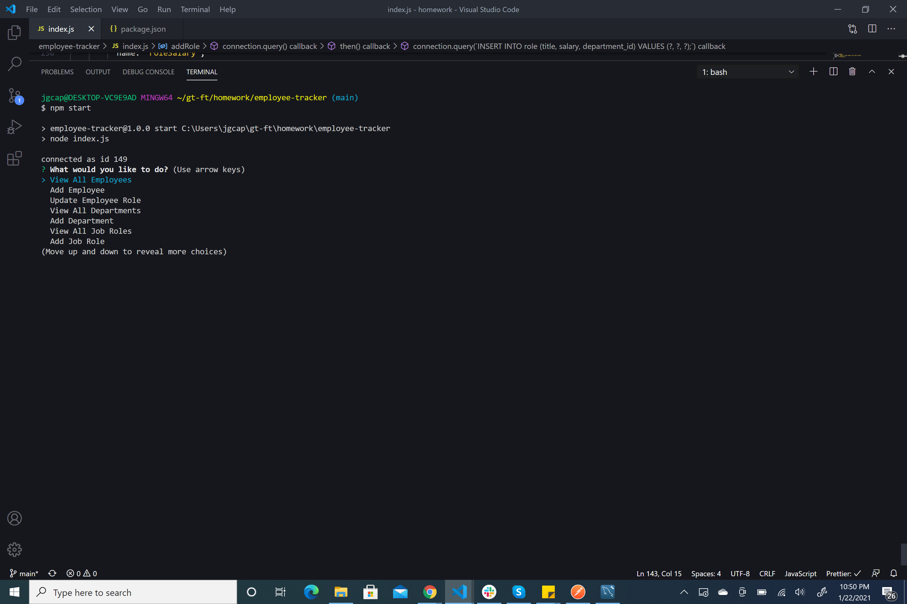
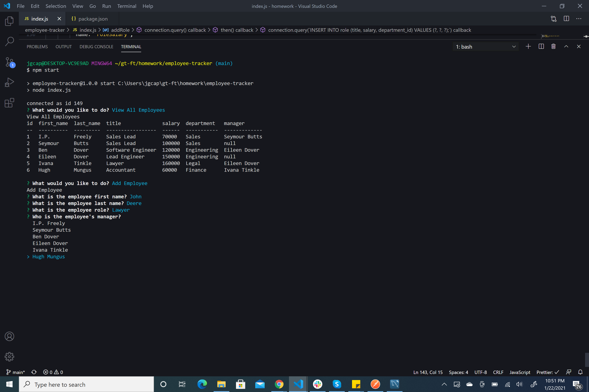

# Employee Tracker

  
  
  ## Table of Contents
  - [Description](#description)
  - [Installation](#installation)
  - [Usage](#usage)
  - [Contributing](#contributing)
  - [Tests](#tests)
  - [Questions](#questions)
  - [License](#license)

  ### Description
  Employee Tracker is a command line interface program, which makes use of MySQL to create a database of employees to be used on the corporate level.  This program allows the user to view or add employees, job roles, and departments.  Upon adding information through the prompts in the terminal, the information is stored back in the MySQL database for later use.
  
  ### Installation
  You may fork the [Repository](https://github.com/Jacquie24/employee-tracker) from GitHub. You must have MySQL installed, and the employeesSchema file can be copied over into the MySQL workbench.  You must also run npm install before attempting to run the program, as there are several npm packages used in this program.
  
  ### Usage
  Upon running the start command in the command line interface, the user is provided a list of activities to choose from as illustrated here. 
  Choose what you would like to do, and the prompts will guide you through the process.  
  
  ### Contributing
  No contributions at this time.
  
  ### Tests
  No tests needed.
  
  ### Questions
  For questions, please check out my [GitHub](https://github.com/Jacquie24) page first.  If you have any further questions, you can email me directly at jgcaption@yahoo.com.
  
  ### License
  This page uses the [MIT](https://choosealicense.com/licenses/mit/) license.